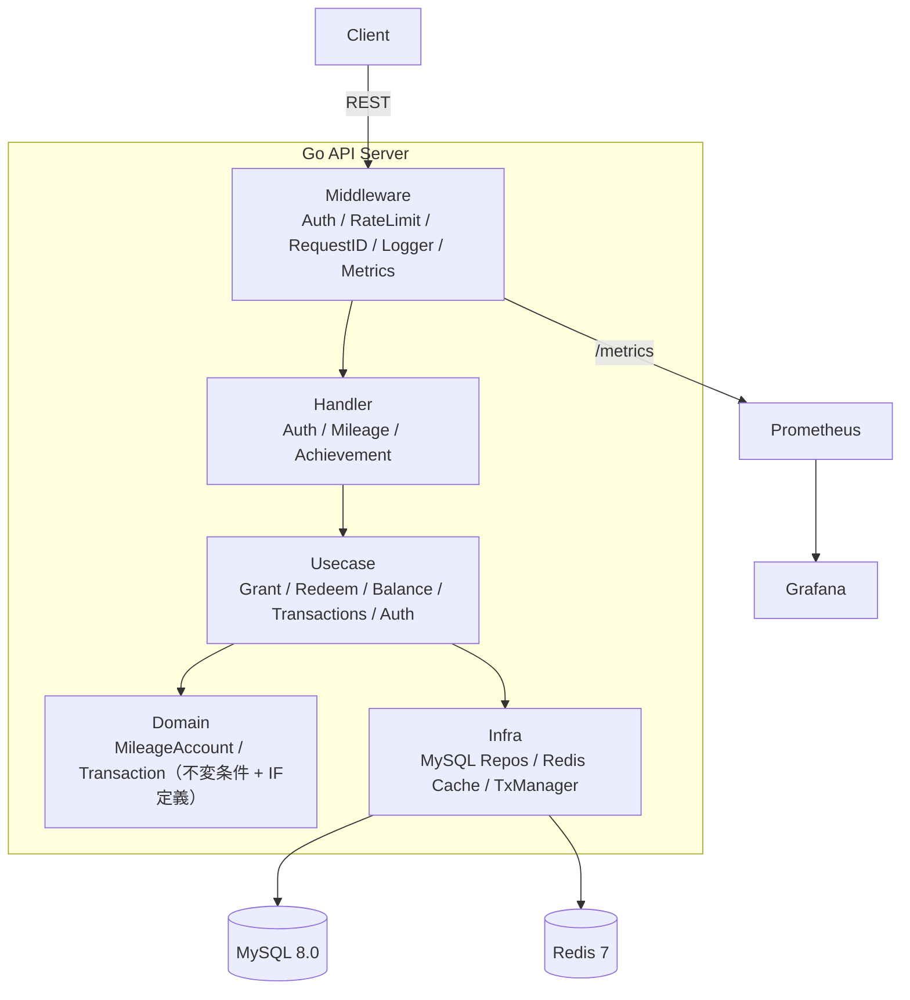

# Mileage Core

Go × パフォーマンス特化のマイレージシステム API。
楽観ロック + 冪等性 + Redis キャッシュを核とするレイヤードアーキテクチャ。

## アーキテクチャ



## 技術スタック

| カテゴリ | 技術 | 用途 |
|----------|------|------|
| HTTP | Echo v4 | ルーティング・ミドルウェア |
| DB | MySQL 8.0 + sqlx | ACID・楽観ロック |
| Cache | Redis 7 + go-redis/v9 | 残高キャッシュ |
| Auth | golang-jwt/v5 (HS256) | JWT認証 |
| Password | bcrypt | パスワードハッシュ |
| Metrics | prometheus/client_golang | メトリクス収集 |
| Logging | zap | 構造化ログ |
| ID | oklog/ulid/v2 | 時系列ソート可能ID |
| 負荷テスト | k6 | シナリオテスト |

## プロジェクト構成

```
mileage-core/
├── cmd/api/main.go                     # DI + Graceful shutdown
├── docker-compose.yml                  # MySQL / Redis / Prometheus / Grafana
├── Makefile
├── migrations/                         # DDL
│
├── internal/
│   ├── config/config.go
│   ├── domain/                         # ドメイン層
│   │   ├── mileage/
│   │   │   ├── account.go              # 集約ルート（Grant/Redeem）
│   │   │   ├── transaction.go
│   │   │   └── repository.go           # IF定義
│   │   ├── user/user.go
│   │   └── achievement/event.go
│   ├── infra/                          # インフラ層
│   │   ├── mysql/{db,tx,*_repository}.go
│   │   └── redis/cache.go
│   ├── usecase/                        # ユースケース層
│   │   ├── auth.go                     # bcrypt + JWT
│   │   ├── grant.go / redeem.go        # 楽観ロック + リトライ
│   │   ├── balance.go                  # Redis → DB
│   │   └── transactions.go             # カーソルページネーション
│   └── server/                         # サーバー層
│       ├── handler/
│       ├── middleware/
│       └── router.go
│
├── bruno/                              # Bruno APIコレクション
├── k6/scenarios/                       # 負荷テスト
├── monitoring/prometheus.yml
└── docs/
```

## セットアップ

```bash
# 1. DB・ユーザー作成（既存MySQLコンテナ使用時）
docker exec mysql mysql -u root -prootpass -e \
  "CREATE DATABASE IF NOT EXISTS mileage CHARACTER SET utf8mb4 COLLATE utf8mb4_unicode_ci;
   CREATE USER IF NOT EXISTS 'mileage'@'%' IDENTIFIED BY 'mileage';
   GRANT ALL PRIVILEGES ON mileage.* TO 'mileage'@'%';
   FLUSH PRIVILEGES;"

# 2. マイグレーション
make migrate

# 3. Redis 起動
docker compose up -d redis

# 4. API起動
make run
```

## API エンドポイント

### 認証不要

| Method | Path | 説明 |
|--------|------|------|
| GET | `/health` | ヘルスチェック |
| GET | `/metrics` | Prometheus メトリクス |
| POST | `/v1/auth/signup` | ユーザー登録 + JWT発行 |
| POST | `/v1/auth/login` | ログイン + JWT発行 |

### 認証必要（`Authorization: Bearer <JWT>`）

| Method | Path | Headers | 説明 |
|--------|------|---------|------|
| GET | `/v1/mileage/balance` | — | 残高照会 |
| GET | `/v1/mileage/transactions` | — | 取引履歴（`?limit=&cursor=`） |
| POST | `/v1/mileage/grant` | `Idempotency-Key` | マイル付与 |
| POST | `/v1/mileage/redeem` | `Idempotency-Key` | マイル消費 |
| POST | `/v1/achievements` | — | 行動イベント登録 |

## DBスキーマ

```mermaid
erDiagram
    users ||--|| mileage_accounts : "1:1"
    users ||--o{ mileage_transactions : "1:N"
    users ||--o{ achievement_events : "1:N"

    users {
        CHAR_26 id PK "ULID"
        VARCHAR email UK
        VARCHAR password_hash
    }
    mileage_accounts {
        CHAR_26 user_id PK_FK
        BIGINT balance
        BIGINT version "楽観ロック"
    }
    mileage_transactions {
        CHAR_26 id PK
        CHAR_26 user_id FK
        BIGINT amount
        ENUM type "grant/redeem"
        VARCHAR idempotency_key "UK(user_id,key,type)"
    }
    achievement_events {
        CHAR_26 id PK
        CHAR_26 user_id FK
        VARCHAR action_type
    }
```

## 設計ポイント

| 課題 | 解決策 |
|------|--------|
| 二重付与/消費 | `UNIQUE(user_id, idempotency_key, type)` + 冪等性チェック |
| 競合更新 | 楽観ロック（version比較 UPDATE、失敗時最大3回リトライ） |
| 読み取り性能 | Redis キャッシュ（write 時 invalidate） |
| ページネーション | カーソルベース（limit+1 取得で次ページ判定） |

## 使い方（curl例）

```bash
# ユーザー登録
TOKEN=$(curl -s -X POST localhost:8080/v1/auth/signup \
  -H 'Content-Type: application/json' \
  -d '{"email":"test@example.com","password":"password123"}' | jq -r .token)

# マイル付与
curl -s -X POST localhost:8080/v1/mileage/grant \
  -H "Authorization: Bearer $TOKEN" \
  -H 'Content-Type: application/json' \
  -H 'Idempotency-Key: grant-001' \
  -d '{"amount":100,"reason":"daily_login"}' | jq

# 残高確認
curl -s localhost:8080/v1/mileage/balance \
  -H "Authorization: Bearer $TOKEN" | jq

# マイル消費
curl -s -X POST localhost:8080/v1/mileage/redeem \
  -H "Authorization: Bearer $TOKEN" \
  -H 'Content-Type: application/json' \
  -H 'Idempotency-Key: redeem-001' \
  -d '{"amount":50,"reason":"coupon"}' | jq

# 取引履歴
curl -s "localhost:8080/v1/mileage/transactions?limit=20" \
  -H "Authorization: Bearer $TOKEN" | jq
```

> Bruno コレクション（`bruno/` ディレクトリ）でも同じ操作が可能。詳細は [Bruno ガイド](docs/bruno_guide.md) を参照。

## テスト

```bash
# ユニットテスト
make test

# 負荷テスト（k6）
make k6-balance          # 200rps 読み取り
make k6-contention       # 同一ユーザー競合
```

## エラーコード

| HTTP | Code | 発生条件 |
|------|------|----------|
| 400 | `BAD_REQUEST` | バリデーションエラー |
| 401 | `UNAUTHORIZED` | JWT無効・期限切れ |
| 409 | `INSUFFICIENT_BALANCE` | 残高不足 |
| 409 | `IDEMPOTENCY_CONFLICT` | 同キー別内容 |
| 429 | `RATE_LIMIT_EXCEEDED` | レート制限超過 |

## ドキュメント

| ファイル | 内容 |
|----------|------|
| [docs/setup_guide.md](docs/setup_guide.md) | セットアップ手順 |
| [docs/bruno_guide.md](docs/bruno_guide.md) | Bruno APIテストガイド |
| [docs/processing_flow.md](docs/processing_flow.md) | 処理フロー図（Mermaid） |