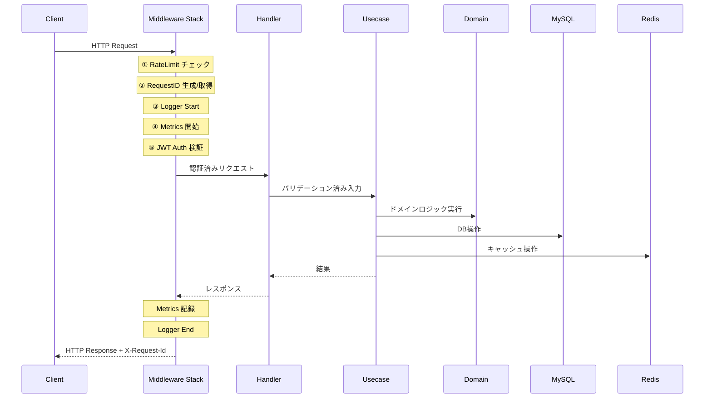
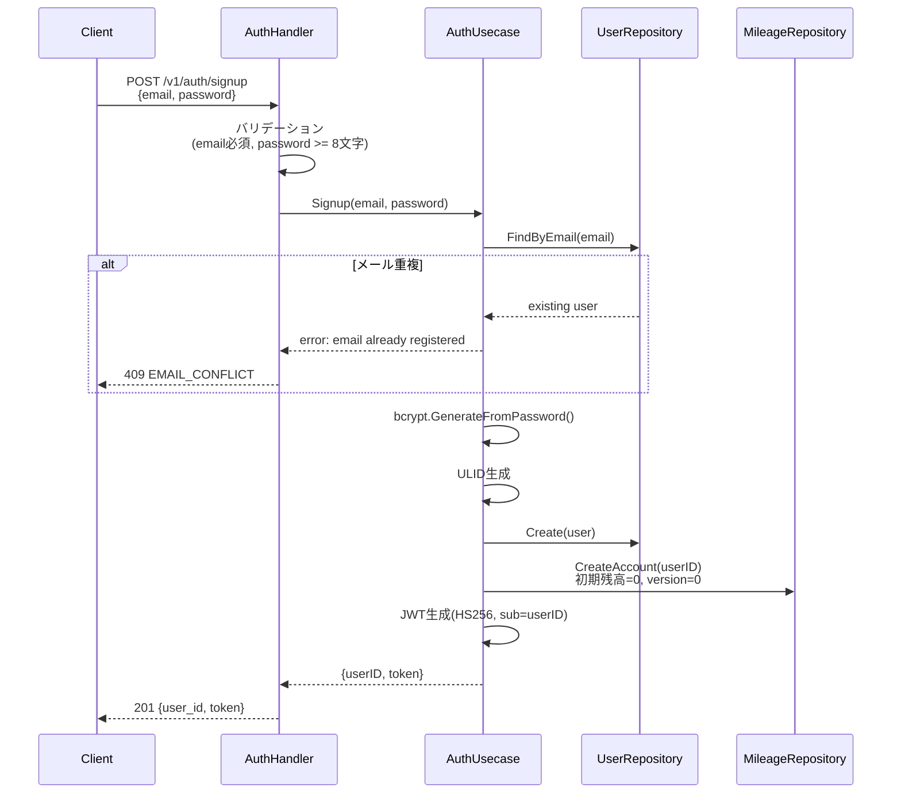
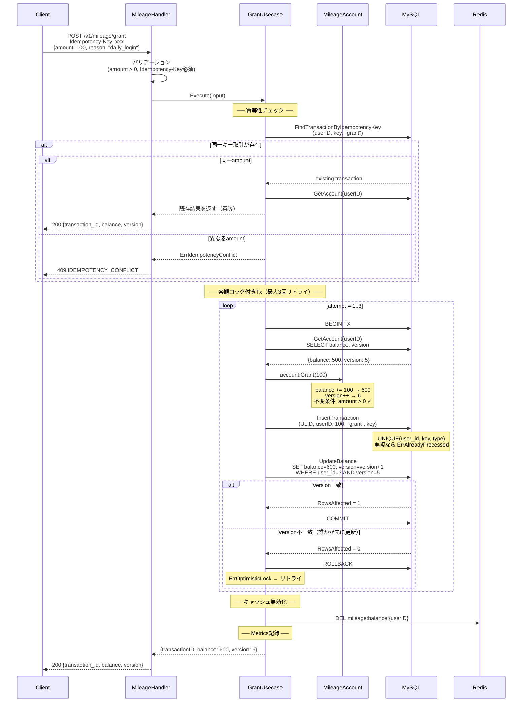
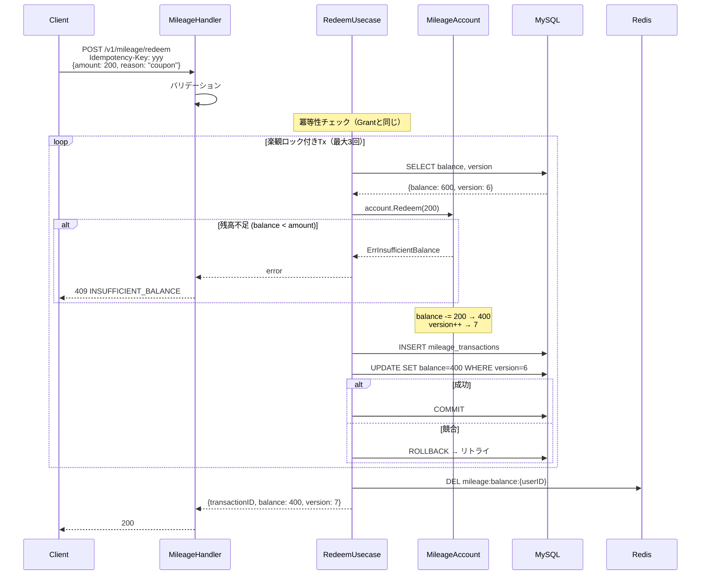
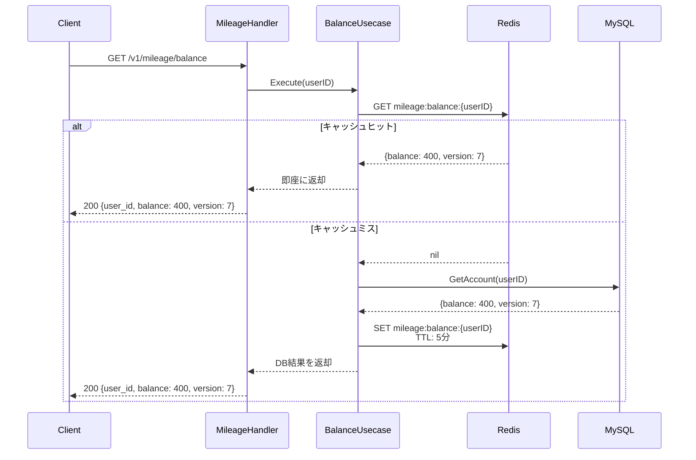
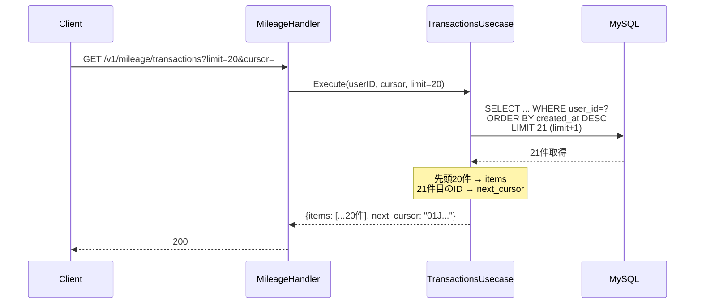
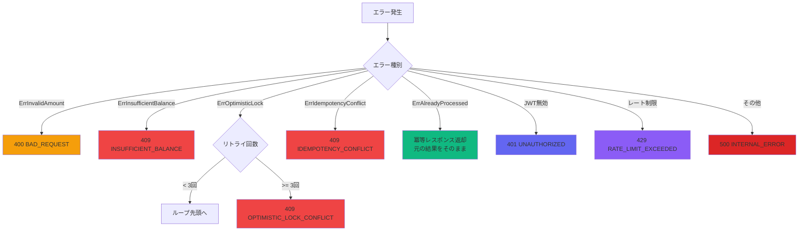
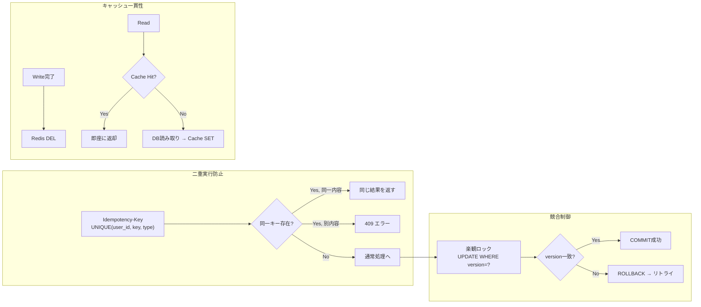

# Mileage Core - 処理フロー詳細

## 1. 全体リクエスト処理フロー

---

## 2. ユーザー登録フロー（POST /v1/auth/signup）

---

## 3. マイル付与フロー（POST /v1/mileage/grant）

---

## 4. マイル消費フロー（POST /v1/mileage/redeem）

---

## 5. 残高照会フロー（GET /v1/mileage/balance）

---

## 6. 取引履歴フロー（GET /v1/mileage/transactions）

---

## 7. エラーハンドリングフロー

---

## 8. データ整合性の保証まとめ

